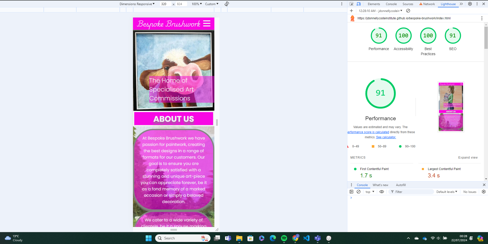

# Bespoke Brushwork

At Bespoke Brushwork we have passion for paintwork, creating the best designs in a range of formats for our customers. Our goal is to ensure you are completely satisfied with a stunning and unique art-piece you can appreciate forever, be it as a fond memory of a marked occasion or simply a beloved decoration.

We cater to a wide variety of clientele, be it a spouse marking an anniversary with an intimate, personalised piece, or a beautifully stylised sign to mark your Christmas party at work.

The aim of the Bespoke Brushwork web-service is to connect our clients with our skilled artist and to have open and evolving conversations with people about their artistic needs. We are not limited to paintwork nor are we limited to a particular art style. We want our customers to have faith in the quality of our work, exemplified across the site, and to either order a piece to be specially made and collected/delivered, or to have their home or place of work become the art via window, mirror, or mural work.

## The Five Planes of User Experience

- __The Strategy Plane__
  - Defining Goals and User Needs:
    - Our goal is defined above, we want to connect potential buyers to our artist and help to create and deliver the unique art piece they desire. Bespoke Brushwork as a site has been designed with that goal in mind.
    - User needs as we see it, are clear presentation of the required information, easy and logical site navigation, and a clear means of making contact with us.

- __The Scope Plane__
  - Determining Features and Content:
    - The header and footer are present and consistent on all pages. The header contains the nav that can take the user to any page, the footer has links to the three main social media pages for an alternate perspective / means of getting in contact with us.
    - Given the artistic and presentation focused nature of our product we have used the landing page main image reel to immediately draw the user's eye.
    - The About Us section provides context and additional information about the service.
    - The Services section provides an easily digestible line-up of some of the different occasions / events we cater to.
    - The gallery facilitates a showcase of the quality artwork and may give users ideas or modifications they may make to their own requests.
    - The enquire page gives users the opportunity to describe to us in detail what exactly they want and it gets the conversation started.
    - The confirmation page will only be navigated to upon successful submission of the form. Its to assure users their request has been received and is thematically coherent with the rest of the site and the enquire page.
    - Features described further in the next section.

- __The Structure Plane__
  - Setting the Sitemap:
    - Home Page - Central hub includes broad stroke information.
    - Gallery - Logical next step for the user to confirm legitimacy and quality.
    - Form - Easily accessible means of getting in touch and describing user needs.

- __The Skeleton Plane__
  - Layout and Navigation Design:
    - Below links to the initial design framework of the homepage that we built from: 
    
    [Wireframe Home Desktop](assets/images/readme/wire-home.png)
    [Wireframe Home Tablet](assets/images/readme/wire-home-tablet.png)
    [Wireframe Home Mobile](assets/images/readme/wire-home-mobile.png)
    [Wireframe Mobile - Nav Open](assets/images/readme/wire-home-burger-menu-mobile.png)
    
    The final product did move away from this slightly, for example:
      - 'The Home of Specialized Art Commissions' became the hero-image cover text rather than aligning with the logo as it made better use of space.
      - The same is true of the nav which was planned as a separate, three piece tab.
      - The hero image itself, instead of being a looped video, was more logical as a reel of the artist's own work.
      - The About Us section, rather than a block of text next to an image, looked much better with the image being overlaid in the background.
      - We also opted to remove LinkedIn as its not a site the artist spends any time on.
    
    - The following links to the design plan for the gallery which remained essentially the same as the finished product:

    [Wireframe Gallery Desktop](assets/images/readme/wire-gallery.png)
    [Wireframe Gallery Tablet](assets/images/readme/wire-gallery-tablet.png)
    [Wireframe Gallery Mobile](assets/images/readme/wire-gallery-mobile.png)

    - There are a couple of small changes between the form plan and the live site. For example, the initial intention was to have an image of the sistine chapel in the background, but the idea to use only the artist's work throughout the site came after.
    - Note also that there is a location field in the original form plan, this was removed as we didn't want potential clients to feel limited because of their geography.
    - The idea for a confirmation page that aligned with the theme of the site also arrived mid-development so was never planned for during the design period.

    [Wireframe Form Desktop](assets/images/readme/wire-form.png)
    [Wireframe Form Tablet](assets/images/readme/wire-form-tablet.png)
    [Wireframe Form Mobile](assets/images/readme/wire-form-mobile.png)

- __The Surface Plane__
  - The Visual Design:
    - We opted for a colour scheme for the header, footer and logo that was as visually striking as it was easy to read. 
    - The hot pink against the white with the 'Playwrite' text for the logo was intended to rouse memories of the likes of Barbie or Disney in the mind's eye of users. With the 'Poppins' font chosen to be complementary and easy to distinguish.
    - Given the nature of the site, and the artist I'm in partnership with, it was a very easy decision to use the artist's own work for essentially all elements of the site. It then came down to choosing based on clarity, vibrancy and the art pieces that most clearly projected the type of work the artist wants to be doing.

## Features

- __Navigation Bar__

  - Featured on all three main pages and the supplementary confirmation page, the fully responsive navigation bar includes links to the Logo, Home page, Gallery and Enquire page and is identical in each page to allow for easy navigation.
  - This section allows the user to easily navigate across all pages and all devices without having to revert via the ‘back’ button.
  - The nav forms a burger menu which can be dropped down to optimise use of space on smaller screens, and has a responsive hover selector that causes the different menu options to light up when hovered over on large screens.
  - Each page has a 'live' class, that indicates to users which page they are currently on improving their experience.

- __The Landing Page Slideshow__

  - The focus of the landing page is a slideshow of some of the artist's work, overlaid with some text to indicate to users what to expect from the site.
  - This section, which, along with the About Us and Services sections, makes up index.html, introduces the user to Bespoke Brushwork with an eye catching animation that cycles through several different art-pieces to grab their attention.
  - The slideshow is responsive, on larger screens showing two images at a time, this was done by halving the width and action percentages of the animation in a media query, and on smaller screens one at a time.
  - It allows users to immediately see some of the types art they can request as well as the different styles and quality of the pieces.

- __About Us Section__

  - The About Us section allows the user to learn a bit about Bespoke Brushwork as an organisation, including our passion and goal.
  - The section is responsive, has readable colour contrast, is in keeping with the overall colour theme, and contains links to the gallery and enquire pages to assist with the user journey.
  - This user will get a taste of the range of art-services we provide, which should encourage and inspire them in selecting art they'll love. 

- __Services Section__

  - This section will give the user a non-exhaustive list of some of the different art-styles, applications and events available to request a commission from Bespoke Brushwork. 
  - The section is clearly readable, responsive and has a faded facade of one of the artist's pieces in the background. 

- __The Footer__ 

  - The footer section includes links to the three main social media sites. The links will open to a new tab to allow easy navigation for the user. 
  - The footer is valuable to the user as it encourages them to keep connected via social media.
  - Currently these only link to the home pages of the respective social media sites, in time, we will create pages on each application for Bespoke Brushwork and link them to the relevant sites.

- __Gallery__

  - The gallery, gallery.html, will provide the user with supporting images to see a broader range of the available art styles and the skills of the artist. 
  - This section is valuable to the user as they will be able to scan for ideas for their own art selection, the quality of the work, the variety of colours and the responsivity of the page also makes for an aesthetically pleasing experience. 

- __The Enquire Page__

  - This page, form.html, will allow the user to make contact with the artist.
  - The page is composed of a form which requires the user's contact information and that they input a description of the type of work they would like to be produced.

- __The Confirmation Page__

  - The confirmation page, confirmation.html, has the same background as the enquire page and is only available when the form has been submitted. The purpose of this page is to indicate to users that they have successfully submitted the form, it gives users comfort that their request has been received and the consistency with the enquire page is good for the user experience.

## Features Left to Implement

- Creating the social media pages for Bespoke Brushwork to be linked in the Footer.
- Creating a database for storage of customer information and linking it to the enquire form.
- Creating the data journey on the enquire page. Setting up an email / business specific contact point for the information to come through to as well as defining SLAs so customers know how long they should expect to wait for a response and the general pricing they should expect.
- Implementing JavaScript for hero image slideshow rather than CSS animation for greater flexibility and smoother functionality.

## Testing 

We undertook a broad array of tests across Google Chrome, Microsoft Edge and Safari as proof of the efficacy of the site.

Testing was mainly focused on functionality and responsivity. The full test script can be observed by going to the file below. No tests failed.

[Bespoke Brushwork Test Script](bespoke-brushwork-test-script.md)

### Validator Testing 

- HTML
  - No errors were returned when passing through the official [W3C validator](https://validator.w3.org/) - screenshots confirming the same are linked below
  - [index.html validation](assets/images/readme/index-validation.png)
  - [gallery.html validation](assets/images/readme/gallery-validation.png)
  - [form.html validation](assets/images/readme/form-validation.png)
  - [confirmation.html validation](assets/images/readme/confirmation-validation.png)
- CSS
  - No errors were found when passing through the official [(Jigsaw) validator](https://jigsaw.w3.org/css-validator/validator#warnings)
  - [style.css validation](assets/images/readme/css-validation.png)

### Lighthouse Scores

The lighthouse evaluation is a dev ops tool that allows you to get a score measured on performance, accessibility, best practices, and search engine optimisation. The aim is to have a score of over 90 for each evaluation point but high 80s is also acceptable. Below are the Bespoke Brushwork scores by page.

The home page:

The gallery page:

The enquire page:

The confirmation page:

### Bugs

- NOT YET FIXED - Images all taken from smart phone rather than online repository. Currently take up too much space (as of 10:00 20/07/2024) and are impacting the performance of the site. Currently investigating means of size reduction to get each page to a state of high performance (a score of 90 or above in the Lighthouse section of Dev Tools).
  - UPDATE - (21:56 20/07/2024) - Progress made. Both the enquire and confirmation pages now showing a lighthouse score >90 for performance. Still working on the gallery and landing pages.
    - FIXED - (21:03 21/07/2024) - Images resized / compressed as appropriate. Lighthouse performance scores within acceptable range.
- FIXED - Height issue with hero image slideshow on large screens due to nature of non-JavaScript method, resolved via media query and altering the inputs of the slideshow animation.
- FIXED - General improvement in responsivity across the site, mainly corrected via media query particularly on About Us and Services sections on index.html.
- FIXED - Hover effect put in place on all Anchor elements to improve user experience, HOWEVER, was not supposed to affect social media anchors in footer, increased selector specificity to exclude footer items and improve user experience.

## Deployment

- The site was deployed to GitHub pages. The steps to deploy are as follows: 
  - In the GitHub repository, navigate to the Settings tab
  - On the left-hand sidebar, in the Code and automation section, select Pages.
  Ensure:
    -  Source is set to 'Deploy from Branch'.
    -  Main branch is selected.
    -  Folder is set to / (root).
  - Under Branch, click Save.
  - Go to Code tab - refresh after a few minutes.
  - Under Environments on the right-hand side click 'github-pages' then View Deployment to see the sight.

### Cloning and Forking

The code can be easily cloned and forked in GitHub

Cloning is the process of completely recreating the code in a directory on your local system with the intent to change/add to it and reincorporate it in the existing site, forking is more akin to branching off with the intention of building on the code and creating something separate of your own.

To clone:
  - Go to the repository in GitHub and hit the button that says <>Code.
  - Once clicked, details for cloning either via HTTP or SSH will appear, the below example shows HTTP.
  - Copy the URL.
  - Use git clone and enter the URL in a git attuned terminal to create an exact copy of the code locally.

[Visual Aid to Assist with Cloning 1](assets/images/readme/clone-step-one.png)
[Visual Aid to Assist with Cloning 2](assets/images/readme/clone-step-two.png)

To fork:
  - Go to the repository in GitHub, choose the file you wish to edit, click the edit button, then GitHub will respond with a pop-up to say you have do not have write access to the code
  - At this point you may opt to fork
  - The ability to do this is dependent on the author's privacy settings

[Visual Aid to Assist with Fork 1](assets/images/readme/fork-step-one.png)
[Visual Aid to Assist with Fork 2](assets/images/readme/fork-step-two.png)

## Credits 

- I followed the tutorial for code institute's love running example project as the skeleton for the Bespoke Brushwork project, particularly when creating the header and footer, the services section, styling the form, and creating the masonry effect in the gallery - The live link can be found here - https://code-institute-org.github.io/love-running-2.0/index.html 
- The explanation for deployment was taken from code institute's Love Running tutorial also - 'Love Running - Essentials Project - 'Let's Deploy'' Lesson.
- The animation slideshow for the hero-image is done entirely with HTML and CSS, the guidance for which can be found here https://www.youtube.com/watch?v=qDww4CbxtD4.
- The code guidance for the text overlay on the slideshow came from the following https://www.youtube.com/watch?v=Si4ViAvvnwU.
- For design planning I used the app Balsamiq Wireframes.
- I used imagify to help reduce the size of my images while minimising the sacrifice to quality https://app.imagify.io/.

### Content 

- The only written content in the site is in the About Us section - written by me.
- The premise for the site and idea for the business came from my partner (the artist).
- The icons in the footer and in the services section were taken from [Font Awesome](https://fontawesome.com/).
- Favicon taken from [favicon.io](https://favicon.io/).
- Fonts taken from [Google Fonts](https://fonts.google.com/)

### Media

- All images used across the site are primary source pictures of my partner's artwork.
